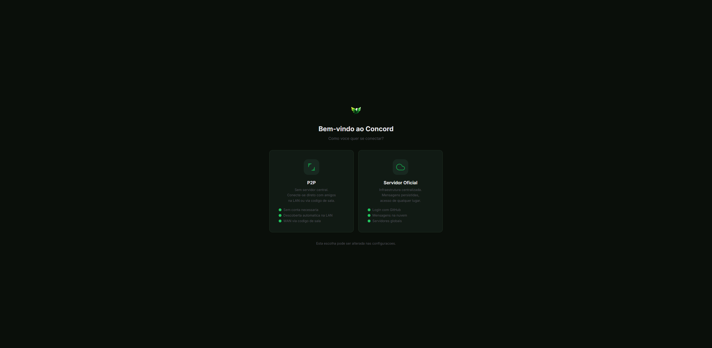
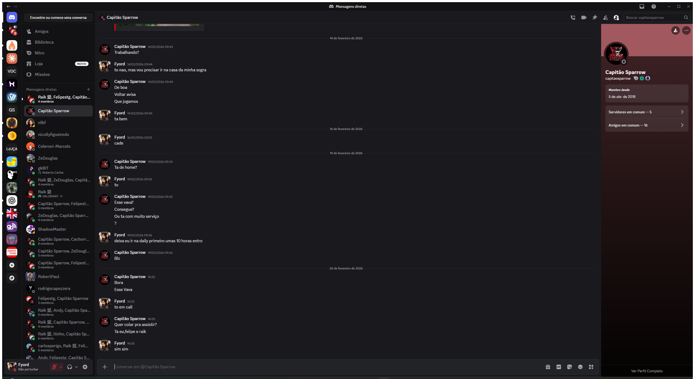

<p align="center">
  
</p>

<h1 align="center">Concord</h1>

<p align="center">
  <strong>Privacy. Freedom. Friendship.</strong><br/>
  Comunicacao para gamers sem coleta de dados. Open-source, peer-to-peer, criptografado.
</p>

<p align="center">
  <a href="https://github.com/JohnPitter/concord/actions/workflows/ci.yml"></a>
  <a href="https://github.com/JohnPitter/concord/releases/latest"></a>
  <a href="LICENSE"></a>
</p>

<p align="center">
  <a href="https://johnpitter.github.io/concord/">Site</a> ·
  <a href="https://github.com/JohnPitter/concord/releases/latest">Download</a> ·
  <a href="ARCHITECTURE.md">Arquitetura</a> ·
  <a href="CHANGELOG.md">Changelog</a>
</p>

---

## Screenshots

<p align="center">
  <br/>
  <em>Escolha entre modo P2P (rede local, sem conta) ou Servidor Oficial (cloud, login com GitHub)</em>
</p>

<p align="center">
  <br/>
  <em>Autenticacao via GitHub OAuth Device Flow — sem senhas armazenadas</em>
</p>

<p align="center">
  <br/>
  <em>Interface principal — DMs, lista de amigos, chat em tempo real, perfil do usuario</em>
</p>

---

## Por que Concord?

> **Concord** e o oposto de **Discord**. Simples assim.
>
> Enquanto Discord significa *discordia*, **Concord** significa *concordia, harmonia*.
>
> Este projeto nasceu como resposta a imposicao de coleta de dados biometricos para verificacao de idade. Ninguem deveria entregar scans faciais ou documentos de identidade apenas para conversar com amigos.
>
> **Sem biometria. Sem rastreamento. Sem scam.**

---

## Download

| Plataforma | Download |
|------------|----------|
| Windows (x64) | [concord-windows-amd64.zip](https://github.com/JohnPitter/concord/releases/latest) |
| macOS (Apple Silicon) | [concord-macos-arm64.zip](https://github.com/JohnPitter/concord/releases/latest) |
| Linux (x64) | [concord-linux-amd64.tar.gz](https://github.com/JohnPitter/concord/releases/latest) |

> Servidor central tambem disponivel nos [releases](https://github.com/JohnPitter/concord/releases/latest) (Linux, macOS, Windows).

---

## Funcionalidades

### Comunicacao
- **Chat de texto** — mensagens em tempo real, busca full-text, historico paginado, edicao e exclusao
- **Chat de voz** — WebRTC peer-to-peer, codec Opus, deteccao de voz (VAD), baixa latencia
- **Compartilhamento de tela** — transmissao direta com QoS adaptativo
- **Mensagens diretas** — DMs privadas entre amigos com notificacoes
- **Traducao em tempo real** — traduza mensagens entre 11 idiomas

### Organizacao
- **Servidores e canais** — crie servidores, organize canais de texto e voz
- **Permissoes** — Owner, Admin, Moderator, Member com controle granular
- **Convites** — codigos de convite com expiracao
- **Mensagens nao lidas** — badges de contagem e destaque nos canais com mensagens novas

### Social
- **Sistema de amigos** — envio/aceite/bloqueio de solicitacoes
- **Presenca online** — status em tempo real com TTL e reaper automatico
- **Active Now** — veja quem esta online e em qual canal de voz

### Infraestrutura
- **Modo P2P** — conexao direta via mDNS na rede local ou pela internet (libp2p)
- **Modo Servidor** — servidor central com PostgreSQL e Redis para escala
- **Login via GitHub** — OAuth Device Flow, sem senhas
- **Auto-update** — verificacao e instalacao automatica de atualizacoes no desktop
- **Temas** — modo escuro e modo claro

---

## Arquitetura

```
┌───────────────────────────────────────────────┐
│            CONCORD DESKTOP APP                │
│                                               │
│  Go Backend (Wails)  ◄──►  Svelte 5 Frontend │
│  ┌────────────────┐       ┌────────────────┐  │
│  │ Auth           │       │ Design System  │  │
│  │ Chat           │       │ Voice Controls │  │
│  │ Voice (WebRTC) │       │ Chat UI        │  │
│  │ P2P (libp2p)   │       │ Server Browser │  │
│  │ Translation    │       │ Settings       │  │
│  └───────┬────────┘       └────────────────┘  │
│          │                                    │
│  ┌───────▼────────┐                           │
│  │ Networking      │                           │
│  │ libp2p + Pion   │                           │
│  └───────┬────────┘                           │
└──────────┼────────────────────────────────────┘
           │
   ┌───────▼──────────────────────────┐
   │ Central Server (opcional)         │
   │ Go + PostgreSQL + Redis + Nginx   │
   │ Signaling + TURN + Watchtower     │
   └───────────────────────────────────┘
```

---

## Stack tecnico

| Camada | Tecnologia |
|--------|-----------|
| Backend | Go 1.25, Wails v2 (OS webview nativo) |
| Frontend | Svelte 5 + TypeScript + TailwindCSS v4 + Vite |
| Voz | Pion WebRTC v4, Opus, VAD (RMS) |
| P2P | libp2p (discovery, relay, NAT traversal) |
| Signaling | gorilla/websocket + Cloudflare Tunnel |
| Banco (client) | SQLite via modernc.org/sqlite (pure Go, no CGo) |
| Banco (server) | PostgreSQL 17 + Redis 7 |
| Observability | zerolog (structured logging) + Prometheus (metrics) |
| Auth | GitHub OAuth Device Flow + JWT (access + refresh) |
| Deploy | Docker Compose + Nginx + coturn + Watchtower |

---

## Deploy

### Quick start com Docker

```bash
cd deployments/docker
cp .env.example .env
# Edite .env com suas credenciais

# Subir stack completo (build + start + tunnel + validacao)
../../scripts/deploy.sh

# Apenas verificar status
../../scripts/deploy.sh --status

# Restart sem rebuild
../../scripts/deploy.sh --no-build
```

O script `deploy.sh` faz:
1. Rebuild da imagem Docker do servidor
2. Start/restart do stack completo (Nginx, Server, PostgreSQL, Redis, coturn, Watchtower)
3. Verifica/inicia o tunnel Cloudflare
4. Valida que todos os servicos estao healthy
5. Atualiza o gist de discovery com a URL publica do tunnel

### Servicos

| Servico | Funcao |
|---------|--------|
| **nginx** | Reverse proxy, gzip, WebSocket, security headers |
| **server** | Concord API + signaling WebSocket |
| **postgres** | Banco de dados principal |
| **redis** | Cache LRU + sessoes |
| **turn** | coturn TURN/STUN relay para NAT traversal |
| **watchtower** | Auto-update do container server |
| **cloudflared** | Cloudflare Quick Tunnel (HTTPS publico) |

---

## Compilar do fonte

### Pre-requisitos

- [Go 1.25+](https://go.dev/dl/)
- [Node.js 20+](https://nodejs.org/)
- [Wails CLI](https://wails.io/docs/gettingstarted/installation): `go install github.com/wailsapp/wails/v2/cmd/wails@latest`

### Build

```bash
git clone https://github.com/JohnPitter/concord.git
cd concord

# Instalar dependencias
go mod download
cd frontend && npm install && cd ..

# Rodar em modo desenvolvimento (hot reload)
wails dev

# Build desktop app
wails build -clean

# Build servidor central
CGO_ENABLED=0 go build -o concord-server ./cmd/server
```

### Testes

```bash
go test -short ./...          # Testes rapidos
go test -v -race ./...        # Todos com race detection
```

### Lint

```bash
golangci-lint run ./...       # Go lint (v2)
go vet ./...                  # Go vet
```

---

## Estrutura do projeto

```
concord/
├── cmd/server/          # Servidor central (PostgreSQL + REST API)
├── internal/
│   ├── api/             # HTTP handlers + middleware (chi v5)
│   ├── auth/            # GitHub OAuth + JWT
│   ├── chat/            # Mensagens + busca + unread tracking
│   ├── config/          # Configuracao (JSON + env vars)
│   ├── friends/         # Amigos, DMs, solicitacoes
│   ├── network/         # P2P (libp2p) + Signaling (WebSocket)
│   ├── observability/   # Logging (zerolog) + Metrics (Prometheus)
│   ├── presence/        # Presenca online com TTL + reaper
│   ├── security/        # Crypto, rate limiting, validacao
│   ├── server/          # Servidores, canais, membros, convites, permissoes
│   ├── store/           # SQLite (client) + PostgreSQL (server) + Redis
│   ├── updater/         # Auto-update do desktop
│   ├── voice/           # WebRTC + Opus + VAD + ICE config
│   └── translation/     # Traducao de mensagens (LibreTranslate)
├── frontend/            # Svelte 5 + TypeScript + TailwindCSS v4
│   └── src/
│       ├── lib/
│       │   ├── api/         # HTTP client para modo servidor
│       │   ├── components/  # UI components (Void design system)
│       │   ├── services/    # voiceRTC, updater, notifications
│       │   └── stores/      # Svelte 5 runes stores
│       └── App.svelte       # Entry point
├── deployments/docker/  # Docker Compose (dev + prod)
├── scripts/             # deploy.sh, tunnel.sh
├── docs/                # SCALING.md, site
├── main.go              # Entry point desktop (Wails v2)
├── ARCHITECTURE.md      # Especificacao tecnica completa
└── CHANGELOG.md
```

---

## Roadmap

| Fase | Feature | Status |
|------|---------|--------|
| 1 | Foundation (config, logging, SQLite, observability) | Completo |
| 2 | Design System "Void" + Layout Shell | Completo |
| 3 | GitHub OAuth (Device Flow) | Completo |
| 4 | Servidores (CRUD, canais, membros, convites) | Completo |
| 5 | Chat de texto (FTS5, paginacao, unread tracking) | Completo |
| 6 | P2P (libp2p, NAT traversal, signaling) | Completo |
| 7 | Voice (WebRTC, Opus, VAD, screen share) | Completo |
| 8 | Social (amigos, DMs, presenca, notificacoes) | Completo |
| 9 | UX (temas, traducao, skeletons, auto-update) | Completo |
| 10 | Scaling (metrics, rate limit, Docker prod, Watchtower) | Completo |
| 11 | Permissoes granulares (Owner/Admin/Mod/Member) | Completo |
| 12 | Traducao de voz (PersonaPlex) | Planejado |

Ver [ARCHITECTURE.md](ARCHITECTURE.md) para o plano completo e [docs/SCALING.md](docs/SCALING.md) para o plano de escala ate 100k usuarios.

---

## Seguranca

- DTLS no WebRTC, TLS 1.3 no QUIC
- Prepared statements (prevencao SQL injection)
- Sanitizacao de dados sensiveis nos logs
- Rate limiting com headers padrao em todos endpoints
- Validacao de uploads (tipo, tamanho, hash)
- JWT com refresh token automatico
- Permissoes por role (Owner > Admin > Moderator > Member)
- TURN relay com autenticacao ephemeral e rate limiting

Reporte vulnerabilidades abrindo uma issue privada.

---

## Licenca

[MIT](LICENSE) — Copyright (c) 2026 Concord Team
